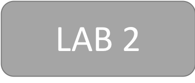

# 
 Monolith to Serverless SaaS Workshop

## Overview
The move from a single-tenant monolithic architecture to a multi-tenant, modern architecture can be challenging for many organizations. The tight coupling and interwoven dependencies of a monolithic environment makes it especially difficult to move your system to microservice. Now, layer on that the goal of moving to a serverless model that supports multi-tenant SaaS and you now have a rather long list of technical, migration, and design challenges that will further complicate this transformation.

Given this complexity, many organizations will attempt to tackle this migration in a more evolutionary fashion where the elements of your system are incrementally transformed to a modern multi-tenant architecture without requiring some “big bang” moment where you completely rewrite your system. This approach also tends to fit better with the business priorities of organizations that are trying to find ways to continue to support existing customers while they gradually move their architecture over to this new model. 

The goal of this lab is to guide you through a monolith to serverless SaaS migration that provides a more in-depth look at the common moving parts of this problem. Certainly, each solution will have its own unique collection of migration challenges. However, seeing a working example can provide you with insights into patterns and strategies that can help shape your approach to moving your monolithic environment to a multi-tenant SaaS model.

In this Lab, we’ll start with a traditional monolithic architecture for a working sample application. Then, we’ll progressively migrate the elements of the single-tenant monolithic architecture to a modern multi-tenant solution. This will include moving to a modern web application, introducing the API Gateway, decomposing the application tier into serverless microservices, and carving data out of our monolithic database and moving management of this data to the individual microservices that take over ownership of managing this data. Along the way, we’ll also introduce the elements needed to introduce multi-tenant best practices into your solution. 

  
## Lab1 – Deploying, Exploring, and Exercising the Single-Tenant Monolith

  
## Lab2 – Onboarding, Identity, and a Modern Client 

  
## Lab3 – Carving Out Our First Multi-Tenant Serverless Microservice

  
## Lab4 – Extracting the Remaining Service—Goodbye Monolith!

[Proceed to Lab 1 when ready to begin.](./Lab1/README.md)

# License
