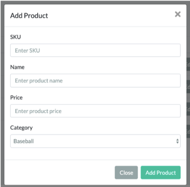
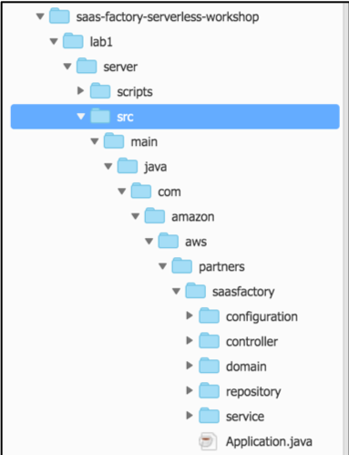
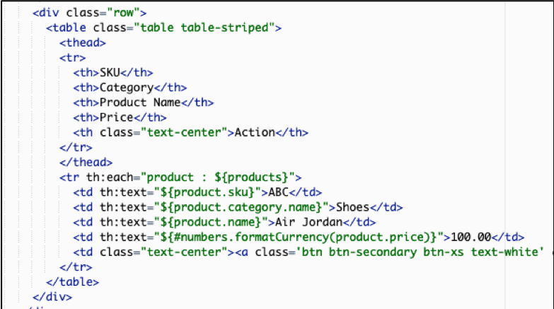

# Lab 1 – Deploying, Exploring, and Exercising the Single-Tenant Monolith
Our transformation process must begin with our baseline monolithic application. We need a reference starting that employs the common monolithic patterns that will represent our starting point for migrating to microservices and multi-tenant SaaS. For our solution, we’ve picked a fairly common Java-based technology stack that should be similar to many of the monolithic solutions that have been commonly employed by different organizations. While we’ve selected Java here, there’s little about this stack that is unique to Java. A .NET monolith, for example, would likely have a footprint very similar to what we have created here.

The architecture employed for our monolith will rely on a traditional EC2-based model where the web and application tiers of our architecture are hosted on a collection of load-balanced, scalable instances. While these are logically separated within the code, they are deployed collectively as one unit. Any change to the web experience or the business logic would require a complete redeployment of this code. This is a classic monolithic challenge (in some cases the web tier may be separate out to allow separate scale and deployment of these two tiers. The data for each customer is stored in a monolithic database that houses all of a customer’s data. The conceptual footprint of this environment is shown in the image below:

<p align="center"></p>

You’ll notice here that we’ve shown two copies of this environment. The idea here is to convey the idea that every customer of this monolithic system will be deployed with a completely standalone infrastructure. This is a common strategy for most single-tenant independent software vendors (ISVs) who essentially treat each customer as have their own unique installation. This usually means separate support, potentially different versions for each customer, different management and operations teams, and so on. 

We’ll start the lab with all the moving parts of this monolith provisioned. We’ll look briefly at some of the key elements of the deployed environment just to give you a glimpse of the architecture and elements of the underlying application components. We’ll then exercise the application just to demonstrate the working application and establish a foundation for the experience we’ll be moving to serverless microservices.

## What You’ll Be Building

This lab is a bit of a mix of familiarizing yourself with the monolith and its underlying architecture as well as the simplified application that we’ll be migrating from the monolith to a serverless, multi-tenant model. The following is a high-level breakdown of the steps that you will be performing in this lab:
*	Provision and explore monolithic environment – at the outset of the lab, you’ll have a fully provisioned single-tenant monolith that represent our starting point. The lab will take you through some basic steps in the console to examine what has been provisioned. It will also get the moving parts of your IDE and development environment created.
*	Exercise the monolithic application – it’s important to at least have some exposure to the moving parts of the application that his being transformed. So, we’ll bring up the application and exercise a few aspects of it and look at the logs and data that are generated from this experience.
*	Examine the code of our monolith to see the moving parts of our solution. The goal here is to expose you to enough of the underlying bits of the monolith that you’ll have a good foundation of knowledge that will be useful as we begin to carve this up.

At the end of this lab, you’ll still have a single-tenant, monolith experience. However, this first element of our transformation—migration of the application of a modern framework—will be complete.

## Step-By-Step Guide
Upon launching this lab, the system provisioned and deployed all the infrastructure for your Java-based, single-tenant monolith application. To get started here, we want to get our Java application deployed to this infrastructure and begin to exercise the deployed application. The following steps will guide your through this exploration.

<b>Step 1</b> – Our goal here is to simulate the developer experience as best we can so we’ve started this lab with a baseline of infrastructure that has no application deployed. To get things, moving we’ll need to start by opening the IDE (Cloud9) that will be used throughout this workshop. To open Cloud9, you’ll need to navigate to the service in the AWS console. 
Once you’ve navigated to the Cloud9 service, you’ll environments that have been created. For this lab, the system has pre-provisioned a configuration for you that will be used throughout this workshop. Within the AWS Cloud9 page, you’ll see the <b>“Serverless SaaS Workshop IDE”</b> listed as one of the environments. Open this environment by selected the <b>“Open IDE”</b> button.

<p align="center"><kbd></kbd></p>

<b>Step 2</b> – Upon opening the IDE, you’ll see the basic land page for the new environment that was provisioned. The goal here was to create a baseline environment that we will then use to configure and deploy our monolith solution. The page will appear as follows:

<p align="center"></p>

The Cloud9 IDE has all the traditional elements you would expect to find in a modern IDE. The pane on the left has your file (which currently only holds a README.md) file. There’s a welcome page in the middle and a command-line shell at the bottom.

<b>Step 3</b> – Now that Cloud9 is open, we need to execute the script that will get our monolith application code, deploy the first copy of the application, and populate the local repository that we will be using as we apply changes during this workshop. This script is at a specified URL and can be executed with a CURL command. To execute this command, navigate to the terminal window at the bottom of the Cloud9 page and enter the following command:

```
curl -s https://raw.githubusercontent.com/brtrvn/srvls/master/resources/bootstrap.sh | bash
```

When this script is done executing, you’ll have all the pieces we need in place to begin exercising our application.

<b>Step 4</b> – Running this script actually created and launched a deployment via CodePipeline. To see the status of this pipeline, navigate to the CodePipeline service within the AWS console. When you access this page, you’ll see the <b>saas-factory-srvls-wrkshp-pipeline-lab1-[ID]</b> pipeline listed amongst the pipelines in your account. The screen should appear as follows:

<p align="center"></p>

Once this pipeline succeeds it will have deployed our monolith application to the infrastructure that was provisioned at the outset of this workshop. If you select the pipeline from the list, you’ll be able to view the execution status of the pipeline. 


<b>Step 5</b> – While our code is being deployed, let’s take a look at some of the infrastructure that will be hosting our application. The architecture that has been pre-provisioned for our monolith is intentionally meant to resemble something that could be on AWS now or on-prem. In this particular monolith solution, we have one cluster that is running all the moving parts of our system. We have deployed this on an EC2 cluster in a multi-AZ configuration with auto-scaling groups. To see the current instances, navigate to the EC2 service within the AWS console. Now, select <b>Auto Scaling Groups</b> from the navigation pane on the left (you may need to scroll to locate the menu item). This will display a list of provisioned auto-scaling groups including our <b>“Serverless-SaaS-Workshop-1-lab1”</b> auto-scaling group. Select the checkbox that corresponds to this auto-scaling group to focus on this group. Now, at the bottom of the page, select the <b>“Instances”</b> to view the EC2 instances in the auto-scaling group. The screen should appear as follows:

<p align="center"></p>


This view indicates that we have 2 running instances in our auto-scaling group. In a production environment, we’d likely provision a larger minimum footprint. These instances sit behind an Application Load Balancer (ALB) that directs traffic to each of the instances shown here.

<b>Step 6</b> – The infrastructure provisioned also includes an Aurora RDS instance. Navigate to RDS in the console and select <b>“Databases”</b> from the navigation pane on the left-hand side of the console. Here, you’ll see the <b>LAB1</b> instance that has been provisioned. The screen will appear as follows:

<p align="center"></p>

This database is deployed with separate reader and writer instances. As our monolith database, it will hold all of the data for our entire single-tenant environment. The code in our application services have access to any of the data in database, enabling them to couple to any and all of the constructs in this database. 

<b>Step 7</b> – Let’s now turn our attention to the running application. To access the application, we’ll first need to confirm that the deployment process has completed. Once again, navigate to the CodePipeline in the AWS console. Check the status of the <b>“saas-factory-srvls-wrkshp-pipeline-lab1-[ID]”</b> and confirm that the pipeline successfully completed the deployment process. 

<b>Step 8</b> – Finally, let’s locate the URL that will be used to access our application. This URL is associated with the ALB that was generated when the environment was created. To access the URL, first navigate to the EC2 service in the AWS console. Then, select <b>“Load Balancers”</b> from the navigation pane on the left-hand side of the page. This will display a list of load balancers. Select the <b>“saas-svs-wrkshp-lab1-[REGION]”</b> from the list and your screen should appear as follows:

<p align="center"></p>

In the description tab at the bottom of this page you’ll find the DNS name we’re looking for on the description tab at the bottom of this page. Copy this DNS name and we’ll use it to access the monolith application.

<b>Step 9</b> – Now that we have the DNS, let’s go to your browser and paste in the DNS name that we collected in the prior step as follows:

    http://[DNS for ALB]

This should open the landing page of our sample monolithic application that will appear as follows:

<p align="center"></p>

<b>Step 10</b> – We can now begin to exercise the moving parts of our application. Let’s start by logging. Select the “Sign In” link at the top right of the page and you will be prompted with the following login form:

<p align="center"></p>

Upon provisioning, we created a user account for you. You can login with the following credentials:
```
Email address: monolith_user@example.com
Password: Monolith123
```

<b>Step 11</b> – Once you land in the application, you’ll see that our e-commerce solution has some very basic functionality. The application that’s been built here was kept intentionally simple. The goal here was to focus more on the migration process and less on creating a fully functional reference application. The application essentially supports CRUD operations for products and orders along with a dashboard to view basic status information. To validate that our environment, let’s start by adding a product. From the navigation options at the top of the page, select “Products” as shown below:

<p align="center"></p>

Once you’ve selected this option, select the “Add Product” option from the page to add a new product to the system. Upon select this option, the following form will be shown:

Fill in the data for a sample product and select “Add Product” to save this product. Repeat this process a few times to a few additional products to the system.

<p align="center"></p>

<b>Step 12</b> – Now let’s look at the code behind this monolith solution. We won’t devote too much time to the monolith code since we’re moving away from it, but it’s helpful to have a bit more context and detail about the application that we’re moving away from. This solution is built with Java, but the concepts here are similar to the patterns that appear in most monoliths. 

To explore the code, you must first re-open the Cloud9 service in the AWS console. Once you open the Cloud9, select the “Serverless SaaS Workshop IDE” that listed as one of the environments. Open this environment by selected the “Open IDE” button.

Now, expand the list of folders in the left-hand pane drilling into the “lab 1” folder. In that folder under “server” you’ll find the “src” folder that holds the source code for our monolith. The main folders of our application are show in the following image:

<p align="center"></p>

The controller folder holds the code that represents the API entry points into your business services. There are also domain objects that hold the representation of our data as it moves through the system. The repository folder holds the code needed to store and retrieve products and orders from the database. The service folder holds the actual business rules and implementation of our services. 

<b>Step 13</b> – Let’s drill into one of the services by opening the service folder. Here you’ll see the various product and order related files that implement our services. There are interfaces (<b>OrderService.java</b>, for example) and an implementation file (<b>OrderServiceImpl.java</b>). Let’s open the or <b>OrderServiceImpl.java</b> file by double-clicking the file name in the left-hand pane. Below is a snippet of code from this file:

```java
@Autowired
private OrderDao orderDao;

@Override
public List<Order> getOrders() throws Exception {
    logger.info("OrderService::getOrders");
    StopWatch timer = new StopWatch();
    timer.start();
    List<Order> orders = orderDao.getOrders();
    timer.stop();
    logger.info("OrderService::getOrders exec " + timer.getTotalTimeMillis());
    return orders;
}

@Override
public Order getOrder(Integer orderId) throws Exception {
    logger.info("OrderService::getOrder " + orderId);
    StopWatch timer = new StopWatch();
    timer.start();
    Order order = orderDao.getOrder(orderId);
    timer.stop();
    logger.info("OrderService::getOrder exec " + timer.getTotalTimeMillis());
    return order;
}
```

Here you see a few methods of our Order service that process GET requests from the client. The first code processes request to get all orders and the second request gets a single order based on an order identifier. This is standard monolith code that has no tenant awareness.

<b>Step 14</b> – The path into these services in the monolith relies on a Model View Controller (MVC) pattern that is commonly supported by frameworks that are used to build monolithic solutions. To get better sense for how requests are processed and pages are rendered in this MVC model, let’s start with the UI of our application (the rendered “view” of in our MVC model). 

Navigate to the application URL that we used above to access the application and sign in with the credentials that were provided. Now, select the “Products” item from the application menu and you will see a list of products (if there are no products, use the “Add Product” option to add some).
Identify a product you want to delete and select the red delete (“Del”) icon that appears at the right-hand edge of each row. A sample of the page is as follows:

<p align="center"></p>

<b>Step 15</b> – Let’s troubleshoot our problem by digging into the “Controller” portion of our MVC model to see why our delete request isn’t working. Navigate to the Cloud9 service and open the IDE for this workshop. With the source tree that appears on the left, navigate to the “lab 1/server/src” folder. Within the nested folders (these correspond to Java’s package naming organization of code), select the “controller” folder. This will give you a list of the controllers that are implemented for our monolith. Select the <b>“ProductsController.java”</b> file to open the editor for this file. 

Within this file, we’ll navigate to the <b>updateProduct()</b> and <b>deleteProduct()</b> methods of our Java class. These two methods represent the entry point of our HTTP calls that will be processed by the various methods in this class. You’ll notice that, within the body of these methods, we are calling the actual product service that is the actual implementation of our service functionality. Let’s take a closer look at these two specific methods to see if we can figure out what’s broken with the delete product functionality that we observed in the application. The two methods are as follows:

```java
@PostMapping("/updateProduct")
public String updateProduct(@ModelAttribute Product product, BindingResult bindingResult, Model model) throws Exception {
    LOGGER.info("ProductsController::updateProduct " + product);
    if (bindingResult.hasErrors()) {

    }
    model.addAttribute("product", product);

    product = productService.saveProduct(product);
    return "redirect:/products";
}

public String deleteProduct(@ModelAttribute Product product) throws Exception {
    LOGGER.info("ProductsController::deleteProduct " + product.getId());
    productService.deleteProduct(product);
    return "redirect:/products";
}
```

At first glance, there doesn’t appear to be anything wrong without <b>deleteProduct()</b> method. However, if you compare it to the <b>updateProduct()</b> method above it, you’ll notice that an <b>@PostMapping</b> annotation is associated with our <b>updateProduct()</b> method. This annotation is missing from our <b>deleteProduct()</b> method. Without this annotation, there’s our HTTP calls will have no routing to the delete method.

To resolve this, we’ll need to simply add the missing annotation to our <b>deleteProduct()</b> method. Do this by adding the annotation as shown below:

```java
@PostMapping("/deleteProduct")
public String deleteProduct(@ModelAttribute Product product) throws Exception {
    LOGGER.info("ProductsController::deleteProduct " + product.getId());
    productService.deleteProduct(product);
    return "redirect:/products";
}
```

<b>Step 16</b> – We now need to save the changes we’ve made to the file and deploy the new version of our controller. Select the “Save All” option from the “File” menu in Cloud9. Then, issue the following commands from the terminal window of Cloud9 to commit our changes and fire off the deployment of our new version.
```
cd /home/ec2-user/environment/saas-factory-serverless-workshop/
git add .
git commit -m “Added annotation to deleteProduct"
git push
```
Committing this change will automatically cause the CodePipeline to trigger a build and deployment of the new product service that includes your changed function.

<b>Step 17</b> – Let’s now verify that our change was applied. Open the application using the URL acquired above and login using the supplied credentials. Now, select the “Products” menu item and attempt to delete a product by selecting the delete (“Del”) button that is on the far right-hand side of the product you want to delete. Assuming your change was applied correctly and the new version completed deployment, your product should now be deleted successfully.

<b>Step 18</b> – As a final step, we want to take a quick look at the web client for this application. While we won’t dig into the code much here, we want to emphasize the fact our monolith is actually rendering and serving all the HTML for our solution from the server. For our solution, we use a Java templating library to represent the UI views of our application. As each request comes into our controller, it is processed and returning a Java model object(s) that represent the results of the call. The framework then binds these objects to templates to render the HTML that is returned.

The nuances of the MVC framework are not essential here. The key here is to realize that our controller uses Java objects to represent our data and a templating framework to bind these objects to the templates—all on the server side. To view a sample UI template, navigate to the Cloud9 service in the console and open the IDE for the workshop. Open the “Lab 1/server/src/main/resources” folder from the source tree on in the left-hand pane of the IDE. Then, open the templates folder and select the <b>products.html</b> template file by double-clicking on the file name. The following is a snippet from <b>products.html</b> UI template file that gives you a sense of how the models are bound to templates:

<p align="center"></p>

This snippet represents the portion of the template that is used to populate this list of products in our table. You’ll notice the <td> entries for the data of our table cells include references to the product model object. For example, the first column resolves to the product SKU with the following syntax:   <b>${product.sku}</b>.
The end result here is that your request ends up serving up the HTML that is the binding of your HTML and your model object(s).

## Review

The goal of Lab 1 was to expose you to the fundamentals of the existing monolith. We reviewed the basic architecture of the monolith environment, acquired the code for our application, and deployed that code to our infrastructure. We then proceeded to exercise that code by running our monolith application. We also explored the underlying code of our monolith to highlight the classic MVC model that is used to build this solution, focusing in on the services and how they are wired up via a controller. In true monolith form, the application was entirely rendered from a single unit of deployment. The web application and the supporting application services were all deployed as a unit to a cluster of EC2 instances. There was no awareness of tenancy in this environment whatsoever.

You have now completed Lab1. 

[Continue to Lab 2](../lab2/README.md)
