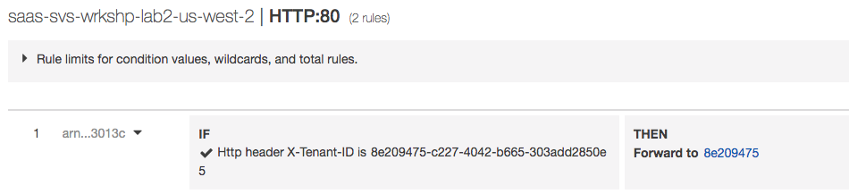
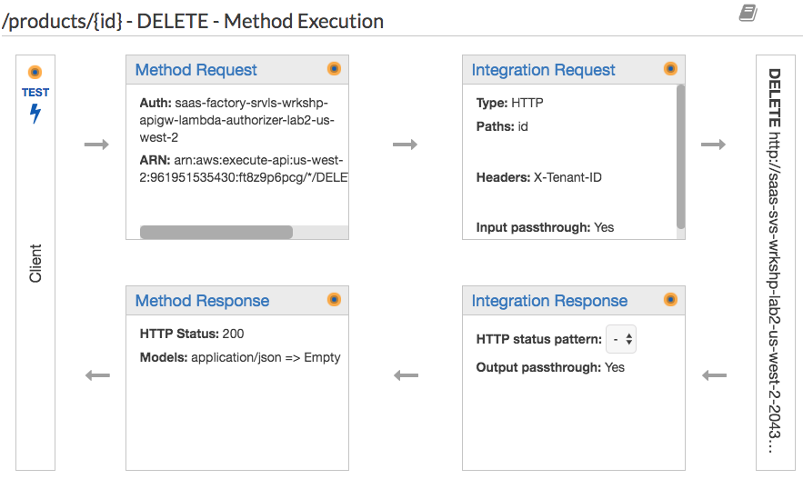

# Lab 2 – Onboarding, Identity, and a Modern Client

Now that we have a fully deployed and functional monolith, it’s time to start looking at what it will take to move this monolith to a multi-tenant, modern architecture. The first step in that process is to introduce a way to have tenants onboard to your system. This means moving away from the simply login mechanism we had with our monolith and introducing a way for tenants to follow an automated process that will allow us to sign-up and register as many tenants as we want. As part of this process, we’ll also be introducing a mechanism for managing tenant identities. Finally, we’ll also create a new client experience that extracts the client from our server-side web/app tier and moves it to S3 as a modern React application.

It’s important to note that this workshop does not dive deep into the specific on onboarding and identity. These topics could consume an entire workshop and we recommend that you leverage our other content on these topics to fill in the details. The same is true for the React client. Generally, there’s aren’t many multi-tenant migration considerations that change your approach to building and hosting a React application on AWS. There a plenty of examples and resources that cover that topic. Our focus for this workshop is more on the microservices pieces of the migration and the strategies we’ll employ with our onboarding automation to allow us to cutover gracefully from single-tenant to multi-tenant microservices.

Our goal here, then, we’ll be to intentionally gloss over some of the details of onboarding, identity, and our new client and get into how our automated onboarding will orchestrate the creation of tenant resource. A conceptual view of the architecture would be as follows:

<p align="center"></p>

Here you’ll see that we now support a separate application tier for each tenant in your system, each of which has its own storage. This allows us to leave portions of our code in our monolith while still operating in a multi-tenant fashion. In this example, Tenant 1 and Tenant 2 are presumed to have already onboarded. Our new S3-based application continues to interact with these tenant deployments via the API Gateway. The challenge here is that we needed to introduce some notion of routing that would allow us to distribute load across each of the tenant clusters. This is achieved via an Application Load Balancer (ALB) that inspects the headers of incoming requests, and routes the traffic to the Network Load Balancers (NLB) that sits in front of each of these clusters. 

Now, as new tenants are added to the system, we must provision a new instance of the application tier for this tenant (shown as Tenant 3). This automated process will both provision the new tier and configure the rules of the ALB to route traffic for Tenant 3 to this cluster.

Our goals for this lab are to enable this new onboarding automation and register some tenants to verify that the new resources are being allocated as we need. Again, the goal here is to only highlight this step and stay out of the weeds of the identity and underlying orchestration that enables this process.

## What You’ll Be Building

Before we can start to dig into the core of decomposing our system into services, we must introduce the notion of tenancy into our environment. While it’s tempting to focus on building new Lambda functions first, we have to start by creating the mechanisms that will be core to creating new tenant, authenticating them, and connecting their tenant context to them for this experience. 

A key part of this lab is building out an onboarding mechanism that will establish the foundation we’ll need to support the incremental migration of our system to a multi-tenant model. This means introducing automation that will orchestrate the creation of each new tenant silo and putting all the wiring in place to successfully route tenants, ideally without changing too much of our monolith to support this environment. As part of enabling this new multi-tenant onboarding, we’ll also extract the UI from the server and move it to a modern framework running in the browser. With this context as our backdrop, here are the core elements of this exercise:
*	Prepare the new infrastructure that’s needed to enable the system to support separate siloes for each tenant in the system. This will involve putting in new routing mechanisms that will leverage the tenant context we’re injecting and route each tenant to their respective infrastructure stack.
*	Introduce onboarding and identity that will allow tenants to register, create a user identity in Cognito, and trigger the provisioning of a new stack for each tenant. This orchestration is at the core of enabling your first major step toward multi-tenancy, enabling you to introduce tenant context (as part of identity) and automation that configures and provisions the infrastructure to enable the system to run as a true siloed SaaS solution.
*	Refactor the application code of our solution to move away from the MVC model we had in Lab 1 and shift to a completely REST-based API for our services. This means converting the controller we had into Lab 1 into an API and connecting that API to and API Gateway.
*	Move from a monolith UI to a modern React UI, moving the code to an S3 bucket and enabling us to align with best practices for fully isolating the UI from the server. This is a key part of our migration story since it narrows the scope of what is built, deployed, and served from the application tier. It also set the stage for our service decomposition efforts.
*	Dig into the weeds of how the UI connects to the application services via the API Gateway. We’ll find some broken code in our UI and reconnect it to the API Gateway to expose you to the new elements of our service integration.
*	Use our new UI to onboard new tenants and exercise the onboarding process. The goal here is to illustrate how we will provision new users and tenants. A key piece of this will involve the provisioning of a new application tier (or monolith) for each tenant that onboards. This will allow us to have a SaaS system where each tenant is running in its own silo while appearing to be a multi-tenant system to tenants.

Once we complete these fundamental steps, we will have all the moving parts in place to begin to start migrating our monolith application tier to a series of serverless functions.

## Step-By-Step Guide

Upon entering this lab, you should have a good sense of the core elements of our monolith. It’s time now to start the modernization process. The steps below will guide you through the migration to a modern UI, the introduction of multi-tenant onboarding, support for authentication with tenant context, and the automated provisioning of tenant application tiers.

<b>Step 1</b> – The first step in our migration to multi-tenancy is to introduce the core infrastructure that will enable us to have separate siloes for each of our monolith environments. Our initial single-tenant simply directed traffic through an ALB that routed our traffic to a single stack for our one customer. However, to support multi-tenancy, we’ll now have multiple instances of our stack running and will need to put new routing infrastructure in front of these stacks to support this new model. 

To introduce these new constructs, we’ll need to first launch a script that will use CloudFormation to configure the elements of this lab. Running the script will require you to navigate to the Cloud9 service in the AWS console and open the IDE for this workshop. Once the IDE is open, go to the terminal window and run the following commands:
```
cd /home/ec2-user/environment/saas-factory-serverless-workshop
lab2.sh
```
This will launch the execution of the CloudFormation script. While we wait for the stack finish building, let’s take a closer look at what it will be creating.

<b>Step 2</b> – As part of moving to a multi-tenant environment, we’ve also opted to migrate our monolith solution (where all the HTML was served from the server) to a modern UI framework that is served from Amazon S3 and executes in the user’s browser. While this could be viewed as a optional step for many that are migrating, we felt it was a compelling strategy and wanted to illustrate how making a move of this nature would influence the look of your final environment. The details of the React application that we’ll deploy are mostly out of scope for this effort, but we encourage you to examine the code more carefully to understand how it interacts with the services of our environment. 

For now, our goal is to simply get this new UI deployed and working so we can begin to interact with our new multi-tenant model. To simplify things, we’ve introduced some basic scripting here to copy our new client to an S3 bucket to make it accessible. To run this script, navigate to your Cloud9 environment and enter the following commands to move to the Lab 2 directory and execute the client deployment script:
```
cd /home/ec2-user/environment/saas-factory-serverless-workshop
bash website.sh
```
<b>Step 3</b> – Let’s go have a look at the status of the infrastructure deployment that we started in step 1 of the Lab. Navigate to the CloudFormation service within the AWS console. Locate the stack in the list that is named <b>“lab2”</b>. This stack is responsible for creating our new routing infrastructure for Lab 2. The screen should be similar to the following:

<p align="center"></p>

Ideally, the stack will have a status of <b>“CREATE_COMPLETE”</b>, indicating that all the elements of the stack have been created. If it is not complete, continue to select the refresh button (just to left of the Delete button at the top of the page) to get updated status. The process is likely already in a completed state. However, if it’s not, you should only have to wait a minute or so to verify that is has finished.

Step 4 – Now that our stack has been created, let’s go look at the infrastructure we’ve introduce. In the new multi-tenant model we’re building in this lab , each request that comes in from our client will include tenant context in a JWT token (we’ll look more about at how that works when we get to client in this lab). The token includes a tenant identifier that is passed to each call the API Gateway that then routes these client requests to the appropriate tenant stack (silo). The first step in making this routing work is to construct the API Gateway and associate a custom authorizer with it that will extract our tenant context and inject a header that will be used for downstream routing of traffic to specific tenant stacks.

A custom authorizer is simply a Lambda function that is invoked with each request that is processed by the API Gateway. Within this Lambda function, we can inspect the incoming token and inject context for downstream processing. To view the customer authorizer that was provisioned, navigate to the API Gateway in the AWS console. And select the <b>“saas-factory-srvls-wrkshp-lab2”</b> from the list of APIs on the left-hand side of the page. Then, with this API selected, choose “Authorizers” from the menu of options that were displayed when you selected the API. Upon selecting this option, you’ll see a page similar to the following:

<p align="center"></p>

You’ll notice here that our authorizer is associated with a specific Lambda function. In this case, our function is entitled <b>“saas-factory-srvls-wrkshp-lambda-authorizer-us-east-1”</b>. 

<b>Step 5</b> –  The code for this lambda exists inside Authorizer.java beneath below folder structure:

<p align="center"></p>

<b>Step 6</b> – Now that we have our API Gateway injecting the header, the next piece to look at is the ALB which will be using this header to route traffic to each of our stacks. To view the ALB that was provisioned for our environment, navigate to the EC2 service in the AWS console and select the “Load Balancers” item from the menu on the left of the page (you may have to scroll down to find this menu item). The next step is to locate the ALB in the list of ALBs. Select the box next to the <b>“saas-svs-wrkshp-lab2-us-east-1”</b>. The page should appear similar to the following:

<p align="center"></p>

With this item selection, you can now select the “Listeners” tab from the bottom of the page to view the listeners associated with this ALB. Now, the expectation here is that we would have seen routing rules in this listener list that would apply the X-TENANT header we injected in the API Gateway to route traffic to the appropriate target group. However, there are no routing rules defined for this ALB. Why is that? It’s because we haven’t actually registered any tenants. This rules only get added during the provision of each new tenant silo. We’ll circle back here after we provision some tenants to see how that changes the configuration of our ALB.

<b>Step 7</b> – Before we can access our new React UI, we’ll need a new URL to use for accessing our application (since it is now hosted on S3 and not served from the application server). To find the URL of the application, you’ll need to navigate to CloudFront service in the AWS console. Upon entering this page, you’ll be presented with a list of distributions. Locate and select the ID for the distribution with the origin value of <b>“serverless-workshop-[identifier]”</b>. This will open detail view of the distribution similar to the following:

<p align="center"></p>

Within this list of attributes, you’ll want to focus your attention on the “Domain Name”. You’ll want to make note of this value, since it will be used throughout the remainder of this workshop to access the client application.

<b>Step 8</b> – Now that we have the URL, we can access the application and verify that it’s work. Enter the URL we captured from the prior step and open the application. When the application opens it will appear as follows:

<p align="center"></p>

This page looks remarkably like the application from the monolith solution that was used in Lab 1. While they look similar, in the real-world scenario, you’d likely re-design aspects of your UI during the re-write with a modern UI framework. We know now, though, that our new UI is up-and-running and being served from S3.

<b>Step 9</b> – With this new multi-tenant environment, we can no longer simply sign-in to the system. As a SaaS system, we can now onboard individual tenants by having them complete the tenant registration process. This is an important critical step in thinking about your migration. With this registration process, we are essentially presenting our system to end users as a fully SaaS system. This represent a key milestone in your migration approach, enabling your old monolith to run largely un-changed while providing the foundation for migrating the underlProductsying implementation without users being aware of the shift to a multi-tenant serverless implementation. 

Let’s create our first tenant by selecting the “Sign Up” button at the top right of our application. Upon selecting this option, you’ll be presented with a form similar to the following:

<p align="center"></p>

Enter the name for your tenant, making sure you provide a valid email address that you can access. This page is meant to be a bit of simplified SaaS registration page, collecting common attributes that might be collected as new tenants onboard. If your organization doesn’t support direct registration, you should still have internal automated tooling that would be collected and used to trigger onboarding.

<b>Step 10</b> – Once you’re in the application, you will be presented dashboard that is a placeholder for providing analytics about your ecommerce business. The page also has a navigation bar at the top to access the various capabilities of the application. The page will appear as follows:

<p align="center"></p>

<b>Step 11</b> – Now, let’s access the product page by selecting the products item from the navigation at the top of the page. Upon selecting the “products” item, you’ll see a page of products (which may be initially empty). The screen will appear as follows:

<p align="center"></p>

<b>Step 12</b> – Select the “Add Product” button on the bottom right of the page to create a new product. Upon selecting this option, you will be presented with a form to enter the product information that appears as follows:

<p align="center"></p>

Enter the product information and select “Add Product” to save your product information. This will return you to the list of products where you will be able to see that your new product was added.

<b>Step 13</b> – Now that we’ve successfully added a tenant and some products to our system, we can now take a closer look at how the system provisioned a stack for each tenant and configured the routing to direct individual tenants to their respective siloes. We’ll start this process by looking at how our tenant was provisioned into Amazon Cognito (which authenticates users and provides the essential JWT token that controls the flow of tenants through the system).
Navigate to the Cognito service within the AWS console and select the “Mange User Pools” from the landing page. In this example, we’re provisioning a separate user pool for each tenant. These pools let us group and configure policies separately for each tenant. After selecting “Manager User Pools”, you’ll be presented with a list of user pools similar to the following:

<p align="center"></p>

Each time you add a new tenant to the system, a new pool will be created. At this point, you should have only one pools since we’ve only added one tenant. Select that pool from the user pool page. This will provide you with a summary of the pool configuration. Now, select “Users and groups” from the left-hand side of the page to view users that currently reside in this pool. The page will appear as follows:

<p align="center"></p>

Listed here will be the user that you registered when you created your tenant. Select the link for your user name to view the attributes of the user you created. A page similar to the following will then appear:

<p align="center"></p>

When we provisioned the tenant user pool, we configured specific attributes that would be allowed to track this user’s relationship to a specific tenant. This is shown in the customer attribute of “tenant-id”. This tenant identifier will now be included in the JWT token that is returned from your authentication experience and will be passed through as part of all our interactions with downstream services.

<b>Step 14</b> – So, we have a tenant identifier embedded in our JWT token and we’ve seen the API Gateway customer authorizer that will inject tenant context. However, if you recall, when we looked at the ALB it did not have any routing rules (yet) because we hadn’t onboarded any tenants. Now we do have a tenant and we can return to see how the ALB was configured to support the routing of this new tenant. To view this new information, navigate to the EC2 service in the AWS console and select “Load Balancers” from the left-hand side of the page (you may have to scroll down some to find it). This will provide you with a list of load balancer similar to the following:

<p align="center"></p>

Select the <b>“saas-svs-wrkshp-lab2-us-east-1”</b> from the list. Now, scroll down the page and select the “Listeners” tab for the ALB. You’ll now see a listener that has been added specifically for our tenant to control routing. Select the “View/edit rule” link associated with the listener to view the underlying configuration of the routing rule. The screen will appear similar to the following:

<p align="center"></p>

This rule examines the value of the X-TENANT header we inserted in our custom authorizer and directs traffic to the target group for our tenant’s stack of hardware. As each new tenant is added, a new rule would be introduced in this list.

<b>Step 15</b> – At In addition to configuring the routing, the onboarding process also provision a separate, siloed infrastructure resources for each tenant that continues to run the application services portion of our silo. If we look closely at the EC2 instances and databases, you’ll find there are separate instances and database that are provisioned for each tenant. We won’t dig into this too deeply. However, it’s a critical element of this model that enables our future incremental move to microservices. Let’s take a quick look at the EC2 resources that we currently have to get a better sense of what was created. Navigate to the EC2 service in the console and select the “Instances” option from the menu on the left-hand side of the page. In this list of instances, you’ll see instances with the name <b>“monilth-tenant-instance-[identifier]”</b> that represent the instances that were provisioned for your new tenant. If you onboard another tenant, you’d see more instances added here to support that tenant.

<b>Step 16</b> – Now that you see how the infrastructure and onboarding have changed to support our multi-tenant model, let’s look at the code a bit more to get a sense of how our new client is interacting with the services of our monolithic services (via the API Gateway). While the backend of our application continues to run in siloes, our client application has no silo awarens. It simply sends HTTP requests to the API Gateway with our tenant context and all the downstream constructs take care of routing our traffic to the appropriate location. This will be more critical as we start to introduce new serverless microservices in Lab 3. 

Let’s start our trace from the client to the server by looking at some code in the React application. To get to this code, you’ll need to open Cloud9 in the AWS console again and open the environment for this workshop. Now, navigate to the <b>/lab2/client/src/actions</b> folder in the navigation pane on the left. Double-click on the index.js file to view its contents. Within this file, you’ll find a </b>“deleteProduct”</b> function that appears as follows:

```javascript
export const deleteProduct = (product) => {
    return function(dispatch) {
        const url = `${config.api.base_url}/products/${product.id}`;
        
        /*
        Axios.delete(url, { data: product })
            .then(() => {
                dispatch(deleteProductFinished(product));
            }, error => console.error(error))
            .then(() => {
                dispatch(closeModal());
            }, error => console.error(error));
        */
    };
};
```

This function is called whenever the client indicates that they want to invoke the DELETE REST method of the Product service. You’ll see here that the actual invocation of this method has been disabled. We’ll need to un-comment the block of code that makes the call as the first step in repairing this broken path in our application.

<b>Step 17</b> – Now that we’ve repaired our client code, we’ll need to re-deploy our changes to S3 to have them applied. With the Cloud9 IDE, navigate to the terminal window and executed the following command to re-deploy our client:
```
cd /environment/Lab 2
bash website.sh
```

<b>Step 18</b> – Now, let’s navigate back to the application and attempt to delete a product (using the URL and credentials we used above). You’ll notice that, despite our changes, delete is still not working. This is because the API Gateway is still not wired to connect to our application tier services. To resolve this, we’ll need to open the API Gateway service in the console and select the “Serverless SaaS REST API” from the navigation pane on the left. This will display the various resources that are part of the system’s REST API. Within the list, you’ll see the resources for “/products”. They will appear as follows:

<p align="center"></p>

To resolve our issue, we need to repair the DELETE method for this resource. Select DELETE to configure this method.

<b>Step 19</b> – Once you’ve selected DELETE, you see the details of the method configuration in a screen that appears as follows:

<p align="center"></p>

<b>Step 20</b> – From here, choose the <b>“Integration Request”</b> at the top of the box that appears at the right. The integration request configures the mapping for our DELETE method. When you choose this option, you will see a screen similar to following:

<p align="center"></p>

The key item to note on this screen is the <b>“Endpoint URL”</b>. It turns out, our endpoint URL is missing a key qualifier. Select the pencil next to the Endpoint URL to edit the value. Append the /{id} to your endpoint and select the checkmark to save the value. This should have repaired the last broken piece of the puzzle.

<b>Step 21</b> – To validate that our change worked, return to the serverless client application (using the URL from above) and sign in with the provided credentials. Now, attempt to delete a product and you should find that our change has resolved the issue.

<b>Step 22</b> – Finally, we should also note how this move to the API Gateway and a new UI model influenced the implementation of our application service. While our goal is to minimize changes to the monolith code, the interaction between the client and the monolith did change from an MVC model to a REST-based API. That meant that the controller portion of our MVC needed to be refactored to expose the REST API that is invoked through the API Gateway. 

To view these changes, navigate to the Cloud9 services in the AWS console and open the IDE for this workshop. In the left-hand pane, open the “lab2/server/src” folder. This will open a series of folders that correspond to the Java package naming. Under the “saasfactory” folder you’ll see an “api” folder that holds the new REST API for our services. Double-click on the <b>“Products.java”</b> file to open the API in the editor. The following is a snippet of code from this file:

```java
@CrossOrigin
@GetMapping(path = "/products/{id}")
public Product getProduct(@PathVariable Integer id) throws Exception {
	logger.info("Products::getProduct id = " + id);
	return productService.getProduct(id);
}

@CrossOrigin
@GetMapping(path = "/products")
public List<Product> getProducts() throws Exception {
	logger.info("Products::getProducts");
	return productService.getProducts();
}
```

While this code does have similarities to the code from our controller, you’ll notice here that we’ve introduced annotations that declare our REST API entry points. This API now returns JSON strings to the client which now assumes responsibility for rendering the HTML.

## Review

While it may not feel as though we’ve done much to enable migration to our serverless SaaS microservices, the work done in Lab 2 is one of the most fundamental bits of plumbing that has to get put into place to enable you to start thinking about carving out individual microservices. With Lab 2, we put all the pieces of multi-tenancy in place without making huge changes to our monolithic application. We introduced onboarding and identity to enable the concept of tenant to get introduced into our environment. We also created all the automated provisioning to create siloed instances of our monolith for each tenant with separate computing and storage for each tenant. At the core of all this was a routing experience that enabled our system to route calls from our client to each tenant stack. Finally, we also made the move here to a modern UI model, introducing a React application that was now served up from S3. By extracting and committing to this new client model, we streamline and focus our efforts as we look to start creating serverless microservices. This prevents our services from being cluttered with worrying about server-rendered HTML.


You have now completed Lab2. 

[Continue to Lab 3](../lab3/README.md)