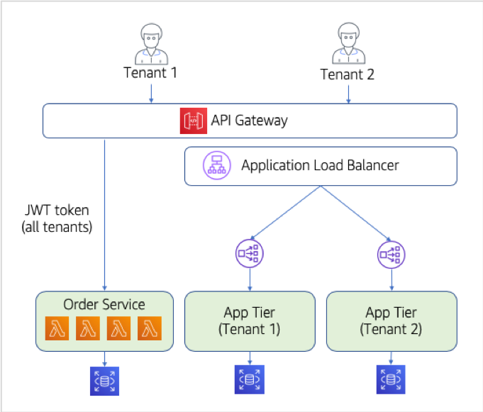
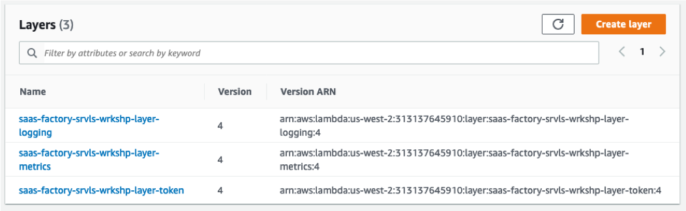

# Lab 4 – Extracting the Remaining Service—Goodbye Monolith!

At this stage, our migration to serverless SaaS is well underway. We have introduced onboarding, identity, and a model that supports side-by-side support for our new multi-tenant microservices and the existing monolith. For many organizations, this represents a key stage in their migration. Having created a microservice and demonstrated that this two-pronged approach can work, you can now focus your energy on carving out more and more services until the monolith is no longer needed.

In a real-world scenario, this transition would be a somewhat involved process where you would need to invest significant time to slowly migrate your business logic and data to a microservices model. However, we’ve limited the functionality of our sample monolith here and want to demonstrate what it would look like to migrate the remaining bits of functionality and completely eliminate the need for the monolith application tier.

To make extract the final bit of functionality out of our monolith, we’ll need to move the product service out to a standalone microservice. This will mimic much of what we discussed above. However, now that we have multiple microservices, we will also need to think about what it will mean to have code and concepts that are common to both of our microservices. We’ll also look at another data partitioning model for this service, having our data represented in a relational database that can store data for all tenants in a shared construct (using what we call a <b>“pool“</b> model).

The architecture at this stage is much simpler. Gone is the need to provision full monolith stacks each time a tenant onboards. Instead, our tenants now all share the serverless microservices that can scale on their own and do not require separate provisioning for each tenant. The diagram below provides a high-level view of the new architecture:

<p align="center"></p>

This diagram represents the completion of our migration process, highlighting that the functionality of our system is now supported by an API Gateway and two logical microservices (which are a composite of multiple Lambda functions).

## What You’ll Be Building

The lab is all about getting your solution moved away from the monolith. The basic elements of making this final migration are as follows:
*	Now that we have a second service, we can see that we need some way to extract and share core concepts that span our services. In the universe of serverless, we can achieve this through the use of Lambda layers. We’ll look at how we can move logging, metrics, and token management to a layer that can be deployed and versioned separately.
*	We’ll extract our last service from the monolith, the product service. This service will mostly move in the same fashion as our prior order service. Once we have this all wired and aligned with our new layers, we will deploy the new product service and deploy the Lambda fucntions for this service. 
*	Once we have these common concepts in our layers, we’ll want to go back to our product and order services and add the instrumentation to use the code in these layers. We’ll update our logging and and add some metrics instrumentation to illustrate how these new mechanisms remove all awareness of tenant context from developers.
*	As part of moving our service over, we also have to consider how we want to represent the product data. In this case, we’ll use a <b>“pool“</b> model for the data where the tables in our relational database will hold the data for all tenant in a shared construct. A column in the table will be used to shard the data by tenant identifier.

Once these basic steps are completed, we’ll have the core elements of our migration completed. We’ll also have layers in place that will simplify the introduction of new services as we move forward. 

## Step-By-Step Guide
The following is a breakdown of the step-by-step process for getting creating for building out or new shared layers and moving the Product service from our monolith to a serverless microservice:

<b>Step 1</b> – Now that we have a second microservice that will be moving into our architecture, we need to start thinking about how we can move common mechanisms that have tenant-context to a reusable mechanism. We could certainly user libraries and frameworks to do this. The question is, how do we make the reusable across our services. This is where Lambda layers come in. With layers, we can separately deploy and version shared code that will support our need to hide away the details of multi-tenancy. So, before moving over our Product service, let’s start by creating these shared constructs.

Let’s start with the token manager class. The role of the token manager is to simplify acquiring the tenant identifier from the supplied JWT token. This class is a shared by the other classes in the layer to acquire a tenant identifier. The code for this class is shown below. 

```java
package com.amazon.aws.partners.saasfactory;

import com.amazonaws.services.lambda.runtime.Context;
import io.jsonwebtoken.Claims;
import io.jsonwebtoken.Jwts;
import org.slf4j.Logger;
import org.slf4j.LoggerFactory;

import java.util.Map;
import java.util.UUID;

public class TokenManager {

    private static final Logger LOG = LoggerFactory.getLogger(TokenManager.class);
    private static final String SIGNING_KEY = "+Kahb1I+prVQZF41dRpNj22qBtAw4Qn1P45VwpELXCc=";

    public static String getTenantId(Map<String, Object> event) {
        return getTenantId(event, null);
    }

    public static String getTenantId(Map<String, Object> event, Context lambdaContext) {
        String bearerToken = ((Map<String, String>)
                event.get("headers")).get("Authorization");
        String jwtToken = bearerToken.substring(bearerToken.indexOf(" ") + 1);
        Claims verifiedClaims = Jwts.parser()
                .setSigningKey(SIGNING_KEY)
                .parseClaimsJws(jwtToken)
                .getBody();
        String tenantId = verifiedClaims.get("TenantId", String.class);
        return tenantId;
    }
}
```

The token manager has two overloaded functions that both get a tenant identifier. The key piece of code here (shown on lines XX-XX) extract the bearer token from the header and unpacks the signed token using a key. Finally, once the token is unpacked, we get the <b>“TenantId“</b> from the claims and returns this value.

To add this file to a layer, first navigate to the Cloud9 service in the AWS console and open the environment for this work. Next, select the <b>“Lab 4/layers/token-manager“</b> folder in the navigation tree on the left.  Right click on the folder and select <b>“New file“</b>. The will add an entry to the folder. Type the file name <b>“token-manager.java“</b> into the placeholder in the source tree the code above into this new file and save it as <b>“token-manager.java“</b> and press enter. Once the file has been created, double-click on the newly added file to open the empty file editor on in the right-hand pane. Now, paste the contents above into the editor and select <b>“File | Save“</b> from the menu at the top left of the IDE.

<b>Step 2</b> – With the token manger in place, we can start to introduce the other layer code that will reference the token manager. The first of these will be the logging manager. By moving our logging code to a layer, we can simply make logging calls and have the logging manager inject the tenant context. Not complicated, but good at hiding away tenant details from developers. This will also ensure that all of our log messages always include tenant context.

Below is a file that represents the code of our logging manager. The file gets the standard logger and wrappers it with two log calls that take different sets of parameters. Ultimately, we want to focus our attention on line XX which uses the token manager to acquire the tenant id before adding it to our log message.

```java
package com.amazon.aws.partners.saasfactory;

import com.amazonaws.services.lambda.runtime.Context;
import org.slf4j.Logger;
import org.slf4j.LoggerFactory;

import java.util.Map;

public class LoggingManager {

    private static final Logger LOG = LoggerFactory.getLogger(LoggingManager.class);

    public static void log(Map<String, Object> event, String message) {
        log(event, null, message);
    }

    public static void log(Map<String, Object> event, Context lambdaContext, String message) {
        String tenantId = TokenManager.getTenantId(event);
        LOG.info("Tenant ID [" + tenantId + "] " + message);
    }
}
```

Next, select the <b>“Lab 4/layers/logging-manager“</b> folder in the navigation tree on the left.  Right click on the folder and select <b>“New file“</b>. The will add an entry to the folder. Type the file name <b>“logging-manager.java“</b> into the placeholder in the source tree the code above into this new file and save it as <b>“logging-manager.java“</b> and press enter. Once the file has been created, double-click on the newly added file to open the empty file editor on in the right-hand pane. Now, paste the contents above into the editor and select <b>“File | Save“</b> from the menu at the top left of the IDE.

<b>Step 3</b> – The last item we’re going to add to our layer is a metrics manager. This helper is used to enable the publishing of metrics data with tenant context. Recording and publishing metrics is essential to SaaS organizations. While what we have here is rather simple and lightweight, it’s important to have the placeholder here to convey the importance of adding metrics to your SaaS solutions. The file shown below represents the simpler metrics manager we’ve created for this workshop.

```java
package com.amazon.aws.partners.saasfactory;

import com.fasterxml.jackson.core.JsonProcessingException;
import com.fasterxml.jackson.databind.ObjectMapper;

import java.io.PrintWriter;
import java.io.StringWriter;
import java.time.Instant;
import java.time.temporal.ChronoUnit;
import java.util.HashMap;
import java.util.Map;

public class MetricsManager {

    public static void recordMetric(Map<String, Object> event, String source, 
                                    String action, Long duration) {
        String tenantId = TokenManager.getTenantId(event);

        Map<String, Object> metric = new HashMap<>();
        metric.put("tenantId", tenantId);
        metric.put("source", source);
        metric.put("action", action);
        metric.put("duration", duration);
        metric.put("utc", Instant.now().truncatedTo(ChronoUnit.MILLIS)\
            .toString().substring(0, 23).replace('T', ' '));

        String json;
        try {
            json = 
                new ObjectMapper().writerWithDefaultPrettyPrinter().writeValueAsString(metric);
        } catch (JsonProcessingException e) {
            // Get the whole stack trace
            final StringWriter sw = new StringWriter();
            final PrintWriter pw = new PrintWriter(sw, true);
            e.printStackTrace(pw);
            LoggingManager.log(event, sw.getBuffer().toString());

            json = e.getMessage();
        }
        LoggingManager.log(event, "MetricsManager::recordMetric\n" + json);
    }
}
```

Next, select the <b>“Lab 4/layers/metrics-manager“</b> folder in the navigation tree on the left.  Right click on the folder and select <b>“New file“</b>. The will add an entry to the folder. Type the file name <b>“metrics-manager.java“</b> into the placeholder in the source tree the code above into this new file and save it as <b>“metrics-manager.java“</b> and press enter. Once the file has been created, double-click on the newly added file to open the empty file editor on in the right-hand pane. Now, paste the contents above into the editor and select <b>“File | Save“</b> from the menu at the top left of the IDE.

<b>Step 4</b> – This takes care of putting the layers we need in place. We now need to deploy these layers to the Lambda service. This deployment can now be completed by entering the following command in the terminal window of the Cloud9 IDE:
```
cd /serverless/Lab 4
[Insert Script Command here]
```
<b>Step 5</b> – To verify that our layers were successfully deployed, let’s open the Lambda service in the AWS console. Once the Lambda page is open, select the <b>“Layers“</b> option from the left-hand side of the page. This will display a list of layers that should include the layers you just deployed. The view will appear as follows:

<p align="center"></p>

<b>Step 6</b> – The next step is for us to move our product service over. In this case, you can see that we’ve pre-populated the system with the code of our service (since it aligns with the same approach that we saw with the Order service). Open the Cloud9 IDE again and navigate to the <b>“Lab 4/product-service/src“</b> folder. Here you will see the various Java files that make up our Product service. Double-click on the <b>“ProducService.java“</b> file to open it in the editor.

Within this file, you’ll see the various methods that implement the GET, PUT, POST, and DELETE methods for our Product service. 

<b>Step 7</b> – The code in this service and the order manager service have both been pre-converted to the new layer scheme that we introduced above. The main difference here is changes to our logging calls. Where our prior version simply called a Java library to log data, our Product and Order services now call our layer, supplying the <b>“event“</b> from our Lambda call that contains our token. If you look at the various logging files in our services, you’ll see logging calls similar to the following:

```java
LoggingManager.log(event, "ProductService::getProducts");
```
<b>Step 8</b> – Before we deploy the Product service, we need to look at how we migrated the data from the monolith representation to our microservice model. As we did with the Order service, we must consider how the Product service will want to represent its data in a multi-tenant model. This means thinking about performance, isolation, and so on. We decided that, for products, we’d demonstrate another flavor of data partitioning, using a <b>“pooled“</b> model where the data for tenants would co-exist in the same tables of a relational database (isolated by a column with a tenant identifier). This means that our service will use the same database for all tenants and won’t require us to provision new tables or other constructs as new tenants are introduced.

In many respects, the code for interacting with the multi-tenant database does not change that much from the silo version (since they were both working against a relational database and the schema is mostly unchanged). Let’s look at a snipped code that illustrates the minor tweaks that are needed to move from our monolith database to our pooled, multi-tenant representation.
```java
private final static String SELECT_PRODUCT_SQL = "SELECT p.product_id, p.sku, p.product, “ + 
                p.price, c.category_id, c.category " +
            "FROM product p LEFT OUTER JOIN ( " +
            "SELECT x.product_id, MAX(x.category_id) AS category_id " +
            "FROM product_categories x INNER JOIN product y ON x.product_id = y.product_id " +
            "GROUP BY x.product_id) AS pc " +
            "ON p.product_id = pc.product_id " +
            "LEFT OUTER JOIN category AS c ON pc.category_id = c.category_id " +
            "WHERE tenant_id = ?”;
```
This code represents the string that is used for our SQL statement to query the database for products. It mirrors what was in our single-tenant monolith. However, one last piece was added at the end. The <b>“WHERE tenant_id = ?“</b> reflects that we’ve added an <b>“tenant_id“</b> column to our relational database and will use it to shard the data for each tenant.

<b>Step 9</b> – With the moving parts of our product service in place, let’s go ahead and deploy our new service. Enter the following commands into the terminal windows of Cloud9 to deploy your Product service:
```
cd /serverless/Lab 4
[Insert Script Command here]
```
<b>Step 10</b> – To confirm that our service is actually running in a multi-tenant fashion let’s verify that the partitioning and the logging messages that we’ve focused on are landing where we expect. Re-open the application (using the URL we captured above) and sign-in to the application. Now, select the <b>“Products“</b> link from the navigation at the top of the page. Now select the <b>“Add Product“</b> button and enter new product information into the Add Product form. When you finish, select the <b>“Add Product“</b> button at the bottom of the form to save the new product information.

<b>Step 11</b> – Our addition of a new product should have inserted a new item into our <b>“pooled“</b> relational database that is managed by our new Product service. To verify this, open the RDS service in the AWS console and select the <b>“Databases“</b> entry from the menu on the left-hand side of the page. Here you’ll see an RDS cluster with the name <b>“saas-factory-srvls-wrkshp-rds-cluster“</b>. 

## Review
This lab was the final step in our move away from the monolith. We moved the last bit of the monolith, the Product service, to a serverless microservice. This eliminated our need to route between the monolith and the microservices and left the system in a fully multi-tenant model. As part of this move, we also took measures to standardize our approach to implementing multi-tenant microservices, introducing layers that would be used to centralize the logging, metrics, and token management that is used by all microservices in our system.
